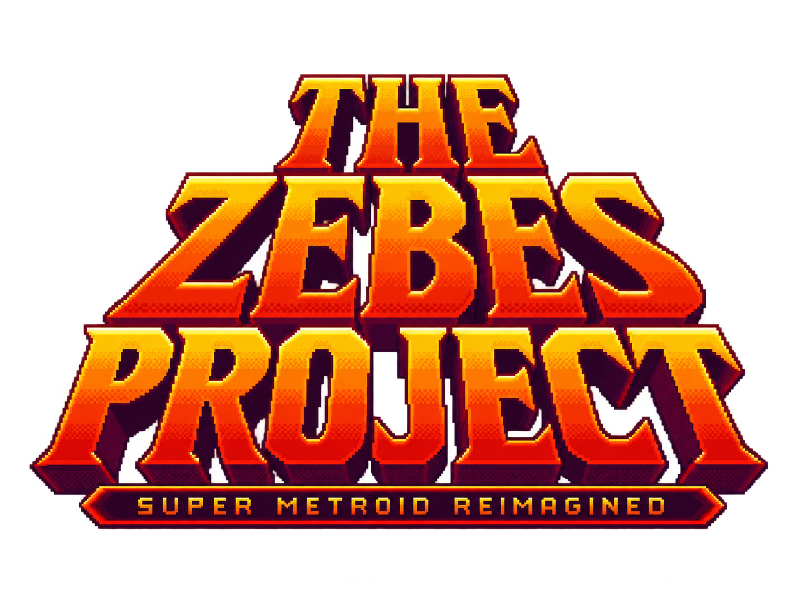

<p align="center">
  
</p>

<h1 align="center">The Zebes Project</h1>
<p align="center"><strong>Rediscover Zebes. Keep the pixels. Change the adventure.</strong></p>
<p align="center">Native gameplay · Unreal atmosphere · Integrated VARIA randomizer</p>
<p align="center"><strong>ALPHA-0.24</strong> · Code: MIT · Project artwork: separate terms</p>

A fan-made native Super Metroid PC project that preserves the original game's
pixel art and brings it into Unreal Engine: widescreen exploration, atmospheric
lighting, modern controls and randomization built directly into the game.
Play the familiar adventure, or make Zebes surprise you all over again.

**This is an alpha for bug testing, not a finished remake.** Vanilla and Randomizer
are playable; Story and Boss Rush remain unavailable previews. Download the
Windows archive or Linux AppImage from [Releases](https://github.com/lovenityjade/zebesproject/releases). See the
[release status](Docs/Releases/ALPHA-0.24/README.md).

## One planet. Your way to play.

### The adventure you remember

- **Vanilla gameplay**, with optional improvements rather than mandatory assists.
- **Independent A/B/C saves**: mix Vanilla and Randomized games, each randomized
  slot keeping its own seed and settings.
- **Native menus and maps**, original fonts and mode emblems; English system
  settings for display, effects, audio, controls and comfort.
- **New Game+** from a completed Vanilla save: retain the recorded equipment and
  resources, face tougher enemies, and preserve the original save.

### A new route through Zebes

- **VARIA generation inside the game**. Configure a new slot, select
  **Generate Game**, then **Start Game** once generation and saving succeed.
- Settings grouped by logic/difficulty, progression, equipment, world, objectives
  and gameplay patches, with advanced technique and combat profiles.
- **Random seed when the number is blank**, shareable settings strings and a
  compatibility preflight that points out conflicting settings.
- **Item and map trackers integrated into the native pause map and minimap**,
  including boss accessibility and PopTracker-compatible check colors. Logic
  uses the seed's settings and current inventory. Trackers are optional in Vanilla.
- **Chozo Tablet Hunt**: collect the configured quota, then race to the ship
  through a timed planetary escape, with the native ending and credit roll.
- Supported VARIA objectives, world options and optional quality-of-life patches.
  **Mirror and Race are intentionally unsupported.** Not every option combination
  or seed route has been exhaustively playtested.

### Original pixels. More atmosphere.

- **Widescreen**, discreet background depth and parallax, with integer scaling
  or fit-to-screen presentation.
- A soft **Lighten/Multiply Gaussian layer** over the world, with the HUD protected.
- Environmental rain, fog, underwater and heat effects, footstep particles,
  electrical effects and stronger weapon/explosion lighting.
- Enhanced opening/title presentation, cinematic fades, animated stars,
  a reworked game-over screen and an atmospheric credits backdrop.
- Customization for visual intensity and comfort, plus startup photosensitivity
  information. The game contains flashing lights and bright effects.

### Less friction, more playing

- Optional **Wall Jump and Space Jump assists**, with original behavior retained.
- Optional **energy/ammo refill at save stations**.
- **LT/RT item cycling**, controller bindings and keyboard controls.
- **Vanilla and NG+ speedrun categories**, using native in-game time. No QoL and
  QoL categories are separate; only the two jump assists qualify for QoL runs.
- Local achievements with in-game notifications, run statistics, and a randomizer
  route recap that retraces the recorded journey.
- **Original or optional Remastered soundtrack** selection. External remastered
  music is not bundled; missing tracks fall back to the original soundtrack.
- An external room-decoration editor for visual extensions and touch-ups, without
  changing collisions or putting the authoring tool inside the game.

For exact behavior and limitations, see [quality of life](Docs/QUALITY-OF-LIFE.md),
[playtest features](Docs/PLAYTEST-FEATURES.md), [trackers](Docs/Tracker/README.md),
[randomizer settings](Docs/Randomizer/FullOptions/STATUS.md) and
[ALPHA-0.24 validation](Docs/ALPHA-0.24-VALIDATION.md).

## Bring your own game

You must supply a legally obtained, unmodified, unheadered compatible ROM:

| Field | Required value |
| --- | --- |
| Suggested filename | `Super Metroid (Japan, USA) (En,Ja).sfc` |
| Size | 3,145,728 bytes |
| CRC32 | `D63ED5F8` |
| SHA-1 | `da957f0d63d14cb441d215462904c4fa8519c613` |

The filename may differ; the bytes must match. On first launch, choose the ROM
and confirm the verified local copy. Every startup checks it again. Missing or
invalid ROMs block game initialization. The project does not download ROMs.
See [ROM setup](Docs/ROM-SETUP.md).

Original game graphics, fonts and room payloads are decoded from your validated
ROM at runtime. No ROM, extracted reference sprites or soundtrack packs are bundled.

## Playing and testing

- **Windows x64:** extract the complete archive into a writable folder and launch
  `SMUnreal.exe`. Keep the folders beside it. If prompted, install Microsoft's
  x64 Visual C++ runtime using `Engine/Extras/Redist/en-us/vc_redist.x64.exe`.
- **Linux x86-64:** make the AppImage executable, then run it. A recent Vulkan
  driver and glibc 2.35 or newer are required. If FUSE is unavailable, run with
  `--appimage-extract-and-run`.
- **macOS:** not included in ALPHA-0.24.

Linux AppImage user data lives in `$XDG_DATA_HOME/zebesproject`, or
`~/.local/share/zebesproject` by default. ROMs and saves remain outside the
read-only AppImage. Windows keeps ROM/runtime data in the extracted game folder;
back up the game's `Saved` profile directory before replacing an installation.

Windows was compiled on Windows and its cooked runtime was checked under
Proton Experimental. This is an alpha smoke test, not certification of every
Windows GPU or every gameplay route. See the release validation notes for scope.

From the native title screen, select a save slot and choose **Vanilla Mode** or
**Randomizer Mode**. **Escape / F4 / right-stick click** opens the settings menu;
**Start** opens the native pause screen in gameplay. **F11** toggles fullscreen.
Bindings and debug tools are available in the system menu.

Before an alpha update, back up your save/profile directory. When reporting a bug,
include the version, platform, game mode, seed and settings string (when relevant),
steps to reproduce, and a screenshot or short clip. Share a minimal log without
secrets or personal paths. **Never attach a ROM, downloaded soundtrack or account
credentials.** Use the [bug report template](.github/ISSUE_TEMPLATE/bug_report.yml).

## On the horizon

These are planned features, **not promises for ALPHA-0.24**:

| Feature | Direction |
| --- | --- |
| **Boss Rush** | All bosses and minibosses, minimum equipment, one chance, a timed challenge and a dedicated leaderboard; Easy, Medium, Hard and Hardcore. |
| **Multiworld** | Native integration with **SekaiLink: Rebooted** and **Archipelago**. |
| **Story Mode** | A Vanilla-based adventure with scripted cinematics, human voice acting and **four endings**. |
| **Online competition** | Discord identity and in-game/web leaderboards. A private receiver/database foundation exists; automatic upload and public rankings are not live. |

See the [roadmap](Docs/FUTURE-MODES.md). There are no announced delivery dates.

## Credits — built on an extraordinary community

| Contribution | People and projects |
| --- | --- |
| Project direction and integration | **TheLovenityJade**, **[Sekailink](https://sekailink.com)** |
| Original game and universe | **Nintendo**, the original Super Metroid development team and its original music staff; original game credits remain in the roll |
| Native C gameplay / runtime | **snesrev**, **DaBanana64**, **lywx**, **elzo_d**, and the [snesrev/sm contributors](https://github.com/snesrev/sm/graphs/contributors) |
| Disassembly and research | **strager / Matthew Glazar**, **Blake Smith**, anonymous contributors, **PJBoy**, **Kejardon**, and [strager/supermetroid contributors](https://github.com/strager/supermetroid/graphs/contributors) |
| VARIA Randomizer | **dude**, **flo**, and the [VARIA contributors](https://github.com/theonlydude/RandomMetroidSolver/graphs/contributors) |
| VARIA's credited foundations/community | **Total**, **Dessyreqt**, **rand 0**, **cout**, **cassc**, **djlo**, **Prankard**, **Smiley**, **Suku**, **Buggmann**, **Artheau**, **Minnie Trethewey**, **mfreak**, **InsaneFirebat**, Metroid Construction, Super Metroid hackers and contributors |
| Native adaptations of VARIA UI/gameplay patches | **Personitis**, **maddo**, **Nodever2**, **Benox50**, **PJBoy**, **Mettyk25jigsaw**, and VARIA contributors |
| Tracker pack/reference maps | **Cyb3R**, **The T**; [PopTracker](https://github.com/black-sliver/PopTracker) / **black-sliver** for the check-color reference |
| Interface and typography | **Omar Cornut** and Dear ImGui contributors; **The Montserrat Project Authors** |
| Engine | **Epic Games / Unreal Engine** |

**Optional soundtrack credits:** **Jammin' Sam Miller**, **JUD6MENT**, **NoNameSD**,
**Blake Robinson / The Synthetic Orchestra**, **The Noble Demon**, **GMB Sound Team**,
**Pontus Hultgren Music**, **VG Music Revisited**, **Dj @tomnium**, **Wingus Dingus**;
intro voice by **Luke Correia**; MSU integration references by **DarkShock** and
**Cubear**. These works belong to their respective creators. See the
[soundtrack credits and sources](Docs/REMASTERED-SOUNDTRACK.md).

Full notices, pinned dependencies and attribution boundaries are recorded in
[THIRD_PARTY_NOTICES.md](THIRD_PARTY_NOTICES.md). Upstream notices are retained;
the tables above do not replace them. Attribution corrections are welcome.

## Transparency and licenses

Our project-authored **code is MIT-licensed**. Project-created artwork and
branding have **separate, reserved rights**; third-party code and assets keep
their own terms. See [LICENSE](LICENSE) and [ASSET_LICENSE.md](ASSET_LICENSE.md).
Unreal Engine is licensed separately by Epic; it is not relicensed by this repo.

The code is developed by humans with AI assistance. Some development graphics
are temporary AI-generated placeholders and are intended to be replaced with
human-created artwork. Credited voice performances and musical recordings are
made by real people. Planned Story Mode voice acting is not yet implemented.

This is an unofficial fan project, not affiliated with, endorsed by or sponsored
by Nintendo or Epic Games. Super Metroid and Metroid are Nintendo properties.
No warranty is provided; alpha builds may contain gameplay, logic or save bugs.

## Build from source (Linux development)

```sh
git clone --recurse-submodules https://github.com/lovenityjade/zebesproject.git
cd zebesproject
git config core.hooksPath .githooks
export SM_ENGINE="/path/to/UnrealEngine-5.8.2"
# The game asks for your compatible ROM on first launch.
./Scripts/build.sh
./Scripts/play.sh
```

Supply your own licensed Unreal Engine installation, CMake, a C compiler,
Python 3 and a shared CPython runtime (3.11–3.14). Follow the ROM picker on launch.
The native gameplay core is a pinned submodule. VARIA is a pinned, unmodified
Python/JSON runtime subset with file hashes in `Randomizer/upstream-provenance.json`.
The disassembly is credited as a research reference and is not bundled. No external PopTracker application or pack is required
at runtime. Rebuilding optional data catalogs requires a separate full checkout
of the pinned VARIA revision and your own ROM; normal compilation uses the
reviewed committed recipes. Staging and push checks reject embedded original
artwork and changed reconstruction recipes.

[Developer notes](Docs/DEVELOPMENT-GUIDE.md) ·
[Changelog](CHANGELOG.md) · [Contributing](CONTRIBUTING.md) ·
[Security](SECURITY.md) · [Release status](Docs/Releases/ALPHA-0.24/README.md)
